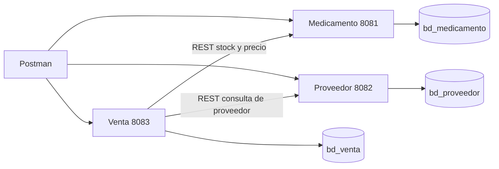

# Arquitectura del laboratorio

```mermaid
flowchart LR
    P[Postman] --> M[Medicamento 8081]
    P --> PR[Proveedor 8082]
    P --> V[Venta 8083]
    V -->|REST stock y precio| M
    V -->|REST consulta de proveedor| PR
    M --> BM[(bd_medicamento)]
    PR --> BP[(bd_proveedor)]
    V --> BV[(bd_venta)]
```
